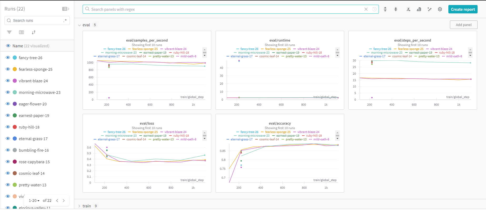
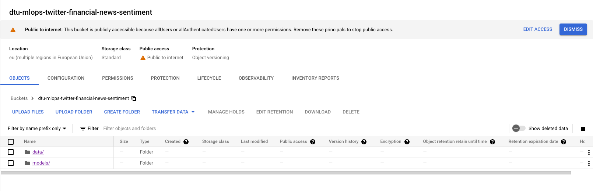
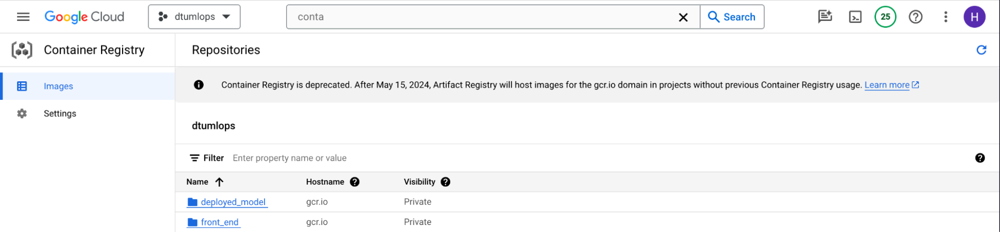
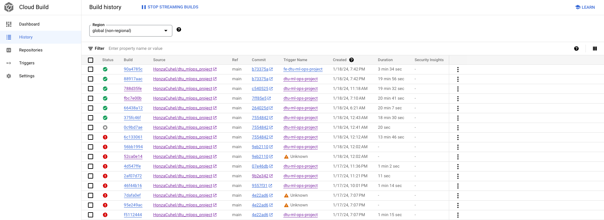
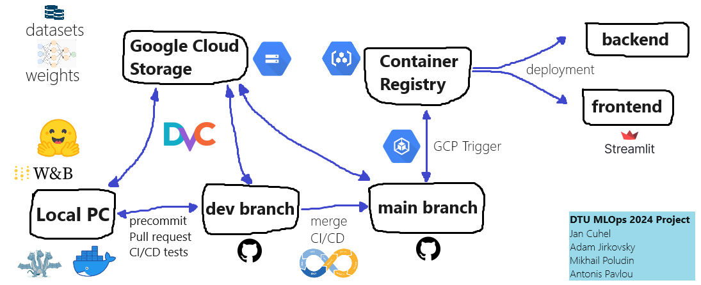

# Exam template for 02476 Machine Learning Operations

This is the report template for the exam. Please only remove the text formatted as with three dashes in front and behind
like:

```--- question 1 fill here ---```

where you instead should add your answers. Any other changes may have unwanted consequences when your report is auto
generated in the end of the course. For questions where you are asked to include images, start by adding the image to
the `figures` subfolder (please only use `.png`, `.jpg` or `.jpeg`) and then add the following code in your answer:

```markdown

```

In addition to this markdown file, we also provide the `report.py` script that provides two utility functions:

Running:

```bash
python report.py html
```

will generate an `.html` page of your report. After deadline for answering this template, we will autoscrape
everything in this `reports` folder and then use this utility to generate an `.html` page that will be your serve
as your final handin.

Running

```bash
python report.py check
```

will check your answers in this template against the constrains listed for each question e.g. is your answer too
short, too long, have you included an image when asked to.

For both functions to work it is important that you do not rename anything. The script have two dependencies that can
be installed with `pip install click markdown`.

## Overall project checklist

The checklist is *exhaustic* which means that it includes everything that you could possible do on the project in
relation the curricilum in this course. Therefore, we do not expect at all that you have checked of all boxes at the
end of the project.

### Week 1

* [x] Create a git repository
* [x] Make sure that all team members have write access to the github repository
* [x] Create a dedicated environment for you project to keep track of your packages
* [x] Create the initial file structure using cookiecutter
* [x] Fill out the `make_dataset.py` file such that it downloads whatever data you need and
* [x] Add a model file and a training script and get that running
* [x] Remember to fill out the `requirements.txt` file with whatever dependencies that you are using
* [x] Remember to comply with good coding practices (`pep8`) while doing the project
* [x] Do a bit of code typing and remember to document essential parts of your code
* [x] Setup version control for your data or part of your data
* [x] Construct one or multiple docker files for your code
* [x] Build the docker files locally and make sure they work as intended
* [x] Write one or multiple configurations files for your experiments
* [x] Used Hydra to load the configurations and manage your hyperparameters
* [ ] When you have something that works somewhat, remember at some point to to some profiling and see if
      you can optimize your code
* [x] Use Weights & Biases to log training progress and other important metrics/artifacts in your code. Additionally,
      consider running a hyperparameter optimization sweep.
* [ ] Use Pytorch-lightning (if applicable) to reduce the amount of boilerplate in your code

### Week 2

* [x] Write unit tests related to the data part of your code
* [x] Write unit tests related to model construction and or model training
* [x] Calculate the coverage.
* [x] Get some continuous integration running on the github repository
* [x] Create a data storage in GCP Bucket for you data and preferable link this with your data version control setup
* [x] Create a trigger workflow for automatically building your docker images
* [ ] Get your model training in GCP using either the Engine or Vertex AI
* [x] Create a FastAPI application that can do inference using your model
* [ ] If applicable, consider deploying the model locally using torchserve
* [x] Deploy your model in GCP using either Functions or Run as the backend

### Week 3

* [ ] Check how robust your model is towards data drifting
* [x] Setup monitoring for the system telemetry of your deployed model
* [ ] Setup monitoring for the performance of your deployed model
* [ ] If applicable, play around with distributed data loading
* [ ] If applicable, play around with distributed model training
* [ ] Play around with quantization, compilation and pruning for you trained models to increase inference speed

### Additional

* [x] Revisit your initial project description. Did the project turn out as you wanted?
* [x] Make sure all group members have a understanding about all parts of the project
* [x] Uploaded all your code to github

## Group information

### Question 1
> **Enter the group number you signed up on <learn.inside.dtu.dk>**
>
> Answer: 

27

### Question 2
> **Enter the study number for each member in the group**
>
> Example:
>
> *sXXXXXX, sXXXXXX, sXXXXXX*
>
> Answer:

s240507, s233562, s240498, s240509

### Question 3
> **What framework did you choose to work with and did it help you complete the project?**
>
> Answer length: 100-200 words.
>
> Example:
> *We used the third-party framework ... in our project. We used functionality ... and functionality ... from the*
> *package to do ... and ... in our project*.
>
> Answer:

For our project, we decided to work with the Hugging Face framework. We utilized this platform to obtain both the dataset and the baseline model. Specifically, we utilized the "Twitter Financial News dataset", an analysis dataset featuring an annotated corpus of finance-related tweets.
As for the baseline model, we selected "DeBERTaV3" from Hugging Face's extensive model repository. Notably, this model stood out due to its efficiency, regardless of the significantly fewer parameters compared to other alternatives. Also, leveraging the Transformers library, which is provided by Hugging Face, we manipulated and fine-tuned the selected model to fulfill the specific requirements of our task.


## Coding environment

> In the following section we are interested in learning more about you local development environment.

### Question 4

> **Explain how you managed dependencies in your project? Explain the process a new team member would have to go**
> **through to get an exact copy of your environment.**
>
> Answer length: 100-200 words
>
> Example:
> *We used ... for managing our dependencies. The list of dependencies was auto-generated using ... . To get a*
> *complete copy of our development environment, one would have to run the following commands*
>
> Answer:

To ensure easy installation of all dependencies we used the `requirements.txt` file. We tried using both `pip` and `pipreqs` to generate the file. First, `pip freeze > requirements.txt` was used, but later we switched to generation with `pipreqs` and added a couple of additional dependencies manually (e.g. *sentencepiece*). This way, the `requirements.txt` looks more sane.

As we have successfully launched both training and inference inside a Docker container, which installs all the dependencies with `RUN pip install -r requirements.txt --no-cache-dir` and `RUN pip install . --no-deps --no-cache-dir`, we know that the new team member wouldn't struggle to do the same.

### Question 5

> **We expect that you initialized your project using the cookiecutter template. Explain the overall structure of your**
> **code. Did you fill out every folder or only a subset?**
>
> Answer length: 100-200 words
>
> Example:
> *From the cookiecutter template we have filled out the ... , ... and ... folder. We have removed the ... folder*
> *because we did not use any ... in our project. We have added an ... folder that contains ... for running our*
> *experiments.*
> Answer:

Yes, we made use of the MLOps cookiecutter template that was provided by the course, so the structure is derived from it mostly. So, there are folders for docker files, for the source code (training and evaluation), for data and models from DVC, for the deployment, tests, CI.
Inside the source code folder: `dtu_mlops_project/` we split it up even more for the folders for config files, visualizations and models definitions. 

On the other hand we didn’t use the `notebooks/` folder and `docs/`. We haven’t touched `notebooks/` because Jupiters weren’t even utilized for development. We did not generate the documentation because we decided to focus on more interesting things :D. However, we decided to leave the folder for possible future improvements.

### Question 6

> **Did you implement any rules for code quality and format? Additionally, explain with your own words why these**
> **concepts matter in larger projects.**
>
> Answer length: 50-100 words.
>
> Answer:

Yes, we used `ruff` and `pre-commit` to check and correct the code formatting. Also, we integrated those checks into the CI\CD pipeline. It checks for code quality and also tries building on different operating systems (windows, ubuntu, macos).

Code quality should be checked in the larger projects, because it could easily become unreadable for developers. Also, it is good to know that all the files have the same formatting, because it makes sense for the project.

## Version control

> In the following section we are interested in how version control was used in your project during development to
> corporate and increase the quality of your code.

### Question 7

> **How many tests did you implement and what are they testing in your code?**
>
> Answer length: 50-100 words.
>
> Example:
> *In total we have implemented X tests. Primarily we are testing ... and ... as these the most critical parts of our*
> *application but also ... .*
>
> Answer:

We implemented 3 tests in total. One of them checks that our processed data can be pulled from DVC and has the correct format. Another checks that the model training function runs successfully and saves the trained model weights. The last test ensures the inference pipeline runs as expected by feeding it with 10 randomly selected samples from the test set and checking the outputs. Our CI pipeline also includes automatic checks for formatting issues with ruff and automatic model evaluation.

### Question 8

> **What is the total code coverage (in percentage) of your code? If you code had an code coverage of 100% (or close**
> **to), would you still trust it to be error free? Explain you reasoning.**
>
> Answer length: 100-200 words.
>
> Example:
> *The total code coverage of code is X%, which includes all our source code. We are far from 100% coverage of our **
> *code and even if we were then...*
>
> Answer:

We reached a 95% code coverage with our tests. This number doesn’t take into account the scripts for data processing and model evaluation. The data processing script is not run regularly, so we focus on testing the format of the actual version-controlled data files. The evaluation script is run in a different workflow to automatically asses model performance, and we do not deem it necessary to create extra unit tests for it. Our least covered file is `predict_model.py` with 79% coverage, because we only test the predict function and not the main loop, which just keeps calling the function for incomming user inputs. We are thus satisfied with the coverage we currently achieve.

### Question 9

> **Did your workflow include using branches and pull requests? If yes, explain how. If not, explain how branches and**
> **pull request can help improve version control.**
>
> Answer length: 100-200 words.
>
> Example:
> *We made use of both branches and PRs in our project. In our group, each member had an branch that they worked on in*
> *addition to the main branch. To merge code we ...*
>
> Answer:

Yes, during the development we worked on separate branches, which were created for each task for each person. After the person was done with his task, he created a pull request on GitHub and each of the other team members needed to approve it before merging.

We had the `main` branch for deployment and the `dev` branch to merge our pull requests to.

An example of our development workflow:
* In the morning we allocated tasks for everyone. For instance, the team member receives *"integrate hydra for configs and logging"* task.
* This person creates a new branch from `dev` and works in it.
* After he is done, he publishes his branch to GitHub and creates a PR to merge into `dev`.
* In the end, we all approve the PR and finally merge it.

### Question 10

> **Did you use DVC for managing data in your project? If yes, then how did it improve your project to have version**
> **control of your data. If no, explain a case where it would be beneficial to have version control of your data.**
>
> Answer length: 100-200 words.
>
> Example:
> *We did make use of DVC in the following way: ... . In the end it helped us in ... for controlling ... part of our*
> *pipeline*
>
> Answer:

Yes, we used Data Version Control (DVC) for managing data in our project. For instance, the training and testing data instances in the `data/` folder and the learned model weights stored in the `models/` folder. It simplified sharing the data between developers. Because when one person created new files (for example the train and test datasets), did `dvc push`, then others can easily download the changes to their pc with a simple `dvc pull`. 

However, since we didn’t have much with DVC before the course, we once had a problem with synchronization of newly trained model weights. The CI pipeline couldn’t pull the data and we spent 3 hours fixing the problem.

### Question 11

> **Discuss you continues integration setup. What kind of CI are you running (unittesting, linting, etc.)? Do you test**
> **multiple operating systems, python version etc. Do you make use of caching? Feel free to insert a link to one of**
> **your github actions workflow.**
>
> Answer length: 200-300 words.
>
> Example:
> *We have organized our CI into 3 separate files: one for doing ..., one for running ... testing and one for running*
> *... . In particular for our ..., we used ... .An example of a triggered workflow can be seen here: <weblink>*
>
> Answer:

In our continuous integration (CI) pipeline, we have structured our workflows into three distinct files. The initial ensures code quality by employing the `ruff check --fix` and `ruff format` commands, effectively identifying and rectifying any formatting issues. This approach ensures that our code adheres to the predefined standards, enhancing readability and maintainability.

Our second workflow focuses on the execution of unit tests, a fundamental aspect of validating the functionality of our codebase. Leveraging caching mechanisms expedites dependency installation, optimizing the overall testing process. Furthermore, we have configured this workflow to operate across multiple major operating systems, namely Windows, macOS, and Ubuntu, while also testing on two recent Python versions, 3.10 and 3.11. Post-testing, an insightful textual coverage report is generated, offering a comprehensive overview of the code's test coverage.

The third and final workflow in our CI arsenal is designed to evaluate the latest model version against our test dataset, providing a crucial assessment of its performance. This workflow, exclusively executed on Ubuntu and Python 3.11, leverages cached dependency installation for efficiency. The obtained results are then seamlessly integrated into the job summary, offering a quick and comprehensive snapshot of the model's current status. 

All three workflow files can be accessed [here](https://github.com/HonzaCuhel/dtu_mlops_project/tree/main/.github/workflows).

## Running code and tracking experiments

> In the following section we are interested in learning more about the experimental setup for running your code and
> especially the reproducibility of your experiments.

### Question 12

> **How did you configure experiments? Did you make use of config files? Explain with coding examples of how you would**
> **run a experiment.**
>
> Answer length: 50-100 words.
>
> Example:
> *We used a simple argparser, that worked in the following way: python my_script.py --lr 1e-3 --batch_size 25*
>
> Answer:

Yes, to use the config files we utilized Hydra. I.e. the config file for training is located in `config/train_config.yaml`. It is directly embedded in the `train_model.py` script, which could be further improved by passing the config name as an argument. After each training cycle, Hydra saves the information of the used config file to the `outpurs/` folder. This folder is not tracked on GitHub.

### Question 13

> **Reproducibility of experiments are important. Related to the last question, how did you secure that no information**
> **is lost when running experiments and that your experiments are reproducible?**
>
> Answer length: 100-200 words.
>
> Example:
> *We made use of config files. Whenever an experiment is run the following happens: ... . To reproduce an experiment*
> *one would have to do ...*
>
> Answer:

First of all, we utilized logging. During the training Hydra was saving the logs to the `outputs/` folder. The information inside a time-stamped subfolder contains all the hyperparameters used to run the experiment that were specified in the hydra config file. However, we decided to leave it only locally and not share the logs e.g. to GitHub. We also used Weights and Biases (as described below) to track the learning progress. Which can enable us to compare different runs.

We’ve also set up the random seed in the config file, so that future experiments with the set seed would have the same initial model weights, which is important to ensure the same resulting model.

### Question 14

> **Upload 1 to 3 screenshots that show the experiments that you have done in W&B (or another experiment tracking**
> **service of your choice). This may include loss graphs, logged images, hyperparameter sweeps etc. You can take**
> **inspiration from [this figure](figures/wandb.png). Explain what metrics you are tracking and why they are**
> **important.**
>
> Answer length: 200-300 words + 1 to 3 screenshots.
>
> Example:
> *As seen in the first image when have tracked ... and ... which both inform us about ... in our experiments.*
> *As seen in the second image we are also tracking ... and ...*
>
> Answer:

We use Weights and Biases (W&B) to track the training of our model. A simple `wandb.init(project="train", entity="dtu-mlops-financial-tweets")` at the beginning of the training script does the job, as the weights and biases framework can work with hugging face’s Trainer automatically. 

As you can see from the screenshot below we track the following metrics:

* **eval/samples_per_second**. It tells us how fast the inference of the model during the evaluation proceeds. As we tried training the model on different devices, it is an interesting metric to see.
* **eval/runtime**. This shows the overall duration of the evaluation. Not really interesting for us.
* **eval/steps_per_second**. Similar to the first metric, it tells how fast the inference goes, just using the different metric.
* **eval/loss**. This one is important, because it tells us how the validation loss is changing during the process of training. You can clearly see that with chosen hyperparameters the loss decreases for some time and then it starts to increase, which could mean the overfitting of the model.
* **eval/accuracy**. This one shows us the achieved accuracy on the validation dataset. Since we trained the model on the financial tweets dataset, we had 3 classes. It computes the number of correct predictions to the total number of predictions. Again, after some time you can see that the accuracy starts to decrease, which could indicate the overfitting. After a couple of training cycles, we achieved the accuracy of **0.85** on the separate testing dataset, corresponding to **0.88** on the validation dataset.




### Question 15

> **Docker is an important tool for creating containerized applications. Explain how you used docker in your**
> **experiments? Include how you would run your docker images and include a link to one of your docker files.**
>
> Answer length: 100-200 words.
>
> Example:
> *For our project we developed several images: one for training, inference and deployment. For example to run the*
> *training docker image: `docker run trainer:latest lr=1e-3 batch_size=64`. Link to docker file: <weblink>*
>
> Answer:

Initially, our project setup includes two Docker files, needed for the deployment and training of our machine learning model. These files are conveniently located in the `dockerfiles/`` directory. Specifically, we have: [predict_model.dockerfile](../dockerfiles/predict_model.dockerfile) dedicated to configuring the prediction environment, and [train_model.dockerfile](../dockerfiles/train_model.dockerfile) designed for setting up the training environment.

Detailed instructions for utilizing these Docker files are written in the main README.md file of our repository. Specifically, it also describes how to execute the training container with a shared volume, ensuring that the model weights generated during the training process are conveniently stored on the host PC to the local `models/` directory.


### Question 16

> **When running into bugs while trying to run your experiments, how did you perform debugging? Additionally, did you**
> **try to profile your code or do you think it is already perfect?**
>
> Answer length: 100-200 words.
>
> Example:
> *Debugging method was dependent on group member. Some just used ... and others used ... . We did a single profiling*
> *run of our main code at some point that showed ...*
>
> Answer:

In the course of our experiments, our debugging approach relied on the VSCode debugger. Our debugging process was to firstly, identify the nature of the issue, by strategically inserting print statements into the code to understand the execution flow and monitor values at different stages. By setting breakpoints, inspecting variables, and stepping through the code, we traced the source of errors and fixed them. In general, our debugging process was iterative and collaborative. Continuous testing and refinement were key to identifying and resolving issues. 
For the styling of our code we used Ruff, which contributed to consistency and cleanliness. By enforcing a uniform style for our code, we managed to not only enhance readability but to also prevent any potential issues or inconsistencies in the code.

## Working in the cloud

> In the following section we would like to know more about your experience when developing in the cloud.

### Question 17

> **List all the GCP services that you made use of in your project and shortly explain what each service does?**
>
> Answer length: 50-200 words.
>
> Example:
> *We used the following two services: Engine and Bucket. Engine is used for... and Bucket is used for...*
>
> Answer:

We used the following three services: Cloud Storage, Cloud Run, Cloud Build.
Cloud Storage is used for storing our processed data set and fine-tuned model using dvc.
Cloud Run is used for deploying our API server and front-end applications.
Cloud Build is used for continuous deployment of our API server and front-end applications.


### Question 18

> **The backbone of GCP is the Compute engine. Explained how you made use of this service and what type of VMs**
> **you used?**
>
> Answer length: 100-200 words.
>
> Example:
> *We used the compute engine to run our ... . We used instances with the following hardware: ... and we started the*
> *using a custom container: ...*
>
> Answer:

Our goal was initially to use Google Compute engine and spin up a VM onto which we would train our model. First, we implemented the training pipeline locally, tested that it works and created a Dockerfile for it. Then we attempted to move the training to Google Cloud Compute, however, we encountered several problems, the biggest one not being able to pull the stored data set using DVC, therefore, we in the end decided to skip this step as we already had a trained model at this point in time. Since our model is fairly small and the data set as well, our experiments with the Compute engine were using only VMs without GPU.


### Question 19

> **Insert 1-2 images of your GCP bucket, such that we can see what data you have stored in it.**
> **You can take inspiration from [this figure](figures/bucket.png).**
>
> Answer:




### Question 20

> **Upload one image of your GCP container registry, such that we can see the different images that you have stored.**
> **You can take inspiration from [this figure](figures/registry.png).**
>
> Answer:




### Question 21

> **Upload one image of your GCP cloud build history, so we can see the history of the images that have been build in**
> **your project. You can take inspiration from [this figure](figures/build.png).**
>
> Answer:



### Question 22

> **Did you manage to deploy your model, either in locally or cloud? If not, describe why. If yes, describe how and**
> **preferably how you invoke your deployed service?**
>
> Answer length: 100-200 words.
>
> Example:
> *For deployment we wrapped our model into application using ... . We first tried locally serving the model, which*
> *worked. Afterwards we deployed it in the cloud, using ... . To invoke the service an user would call*
> *`curl -X POST -F "file=@file.json"<weburl>`*
>
> Answer:

For deployment we wrapped our model into an application using FastAPI. We first tried locally serving the model, which worked. Afterwards we deployed it in the cloud, using Cloud Run. Even further we set up a continuous deployment whenever there is a push to the main branch of the repository. To invoke the service a user would call

```
curl -X 'POST' \
'https://deployed-financial-tweet-sentiment-o64hln5vbq-ew.a.run.app/predict_batch/' \
  -H 'accept: application/json' \
  -H 'Content-Type: application/json' \
  -d '["I think $TSLA is going to the moon!"]'
```

To make the usage more user friendly, we also created a Front-End application using streamlit to test the model. We also set up the CD pipeline using Cloud Build. The FE app is available [here](https://fe-financial-tweet-sentiment-o64hln5vbq-ew.a.run.app).


### Question 23

> **Did you manage to implement monitoring of your deployed model? If yes, explain how it works. If not, explain how**
> **monitoring would help the longevity of your application.**
>
> Answer length: 100-200 words.
>
> Example:
> *We did not manage to implement monitoring. We would like to have monitoring implemented such that over time we could*
> *measure ... and ... that would inform us about this ... behaviour of our application.*
>
> Answer:

We added the Prometheus instrumentator to our deployed API server using the prometheus-fastapi-instrumentator python package. By doing this our application exposes the metrics on the [/metrics](https://deployed-financial-tweet-sentiment-o64hln5vbq-ew.a.run.app/metrics) endpoint. It is a list of key-value pairs about the HW usage at the moment. This could be easily integrated into Grafana to create dashboards. Apart from this, we did not implement any other monitoring, fortunately, because we are using Cloud Run to run our applications, we can easily look at the number of requests, request latencies, container CPU and memory utilization, billable container instance time and so on. This setup fulfills our requirements.


### Question 24

> **How many credits did you end up using during the project and what service was most expensive?**
>
> Answer length: 25-100 words.
>
> Example:
> *Group member 1 used ..., Group member 2 used ..., in total ... credits was spend during development. The service*
> *costing the most was ... due to ...*
>
> Answer:

In total we spent 2.28$ during development. The service costing the most was Cloud Storage due to storing the splitted data set and also trained model (around 280MB).


## Overall discussion of project

> In the following section we would like you to think about the general structure of your project.

### Question 25

> **Include a figure that describes the overall architecture of your system and what services that you make use of.**
> **You can take inspiration from [this figure](figures/overview.png). Additionally in your own words, explain the**
> **overall steps in figure.**
>
> Answer length: 200-400 words
>
> Example:
>
> *The starting point of the diagram is our local setup, where we integrated ... and ... and ... into our code.*
> *Whenever we commit code and push to github, it auto triggers ... and ... . From there the diagram shows ...*
>
> Answer:



The project structure is an MLOps framework that begins with developers working on local PCs, possibly performing tasks such as training machine learning models. They utilize pre-commit hooks to maintain code quality, and subsequently, they push changes to a development (dev) branch on GitHub through pull requests from their respective personal branches.

Data Version Control (DVC) plays a crucial role in this setup, integrating with Google Cloud Storage to manage and version datasets and model weights. This ensures that the data is consistently synchronized with the codebase, facilitating reproducibility and collaboration. When pull requests are submitted, Continuous Integration (CI) tests are triggered, ensuring that the new contributions do not break the existing codebase.

Upon successful CI tests, changes are merged into the dev branch. The progression of changes from the dev to the main branch sets off the deployment workflows. The Google Cloud Platform (GCP) Trigger is activated by these merges, which leads to the creation of new container images that are stored in the Container Registry.

For the backend, the updated model weights are downloaded directly from Google Cloud Storage, ensuring that the most recent and accurate data is used in production. The frontend of the project is developed using the Streamlit library, a popular choice for quickly crafting interactive web pages that serve as interfaces for machine learning models, particularly useful for demonstrating proofs of concept.

This MLOps process is designed to be efficient, automated, and scalable, addressing the critical needs of modern machine learning and data science projects. It allows for the streamlined transition from development to deployment, ensuring that model improvements are rapidly and reliably delivered to end-users.
 
### Question 26

> **Discuss the overall struggles of the project. Where did you spend most time and what did you do to overcome these**
> **challenges?**
>
> Answer length: 200-400 words.
>
> Example:
> *The biggest challenges in the project was using ... tool to do ... . The reason for this was ...*
>
> Answer:

Navigating the intricacies of managing data and models on the Google Cloud Platform (GCP) and utilizing DVC has been a complex journey for our team, marked by various challenges. A significant hurdle revolved around establishing a seamless authentication process within the team to facilitate the smooth pushing of data into the DVC storage bucket. We were unable to find any reliable authentication method and had to settle with a cumbersome manual process of granting public access to our storage bucket whenever a team member needed to push files with DVC.

It also took us some time to figure out that we need to mount the storage bucket directly in Cloud Run or Compute instances to access our data, because DVC pull was not working in these cloud instances. 

Our most frustrating struggle was also caused by DVC, when it deliberately deleted the remote storage information for our newly trained model weights inside the corresponding .dvc file. We spent three hours reverting git commits and trying to resync them with DVC before we found the cause of the problem and manually adjusted the models.dvc file.

In essence, our journey with GCP and DVC has been a learning experience, demanding adaptability and problem-solving skills to overcome the intricacies associated with data management and model versioning in this dynamic environment.

### Question 27

> **State the individual contributions of each team member. This is required information from DTU, because we need to**
> **make sure all members contributed actively to the project**
>
> Answer length: 50-200 words.
>
> Example:
> *Student sXXXXXX was in charge of developing of setting up the initial cookie cutter project and developing of the*
> *docker containers for training our applications.*
> *Student sXXXXXX was in charge of training our models in the cloud and deploying them afterwards.*
> *All members contributed to code by...*
>
> Answer:

All members contributed equally to the code and this report. Each project day we had 1+ zoom calls to assign the tasks to each other for the day. Each team member was present on every call.

Student s240507 (Mikhail) was in charge of things such as: Hydra setup, Docker containers for training and inference, actual training of the model.

Student s240509 (Jan) was in charge of things such as: Weights&Biases setup, model deploying, continuous deploying, setting up DVC, Google Cloud Storage, creating make rules.

Student s240498 (Adam) was responsible for creating the data processing pipeline, creating the model evaluation script, writing unit tests, and setting up the CI pipeline for testing and model evaluation.

Student s233562 (Antonis) was in charge of the training setup, Ruff and Pre-commit setup and creating the frontend with Streamlit.
